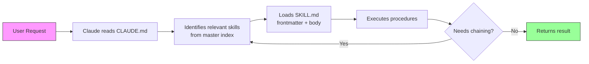

# Claude Skills Library


A modular library of 26 reusable Claude AI skills for cross-platform app development, content creation, quality assurance, and automation. Built on Anthropic's official Claude Code Skills specification.

## Architecture



## Quick Start

### 1. Clone the repository

```bash
git clone https://github.com/danielcarmo/claude_skills.git
cd claude_skills
```

### 2. Validate your environment

```bash
chmod +x tools/setup.sh
./tools/setup.sh
```

### 3. Use with Claude Code

Claude Code automatically reads `CLAUDE.md` in the project root. Simply open this project in Claude Code and start making requests. Claude will identify and load the relevant skills.

```
# Examples of requests that trigger skills:
"Review this pull request"                    # -> code-review
"Create a sprint plan for these features"     # -> sprint-planning
"Audit this page for accessibility"           # -> accessibility-audit
"Write a landing page for our new product"    # -> conversion-copywriting
"Set up CI/CD for this React Native app"      # -> ci-cd-pipeline + cross-platform-dev
```

## Skills by Category

### Research
| Skill | Description |
|-------|-------------|
| `deep-research` | Conducts multi-source deep research with structured reports and citations |
| `domain-intelligence` | Gathers and synthesizes domain-specific intelligence and market insights |
| `data-analysis` | Analyzes datasets, generates insights, and creates visualization recommendations |

### Design
| Skill | Description |
|-------|-------------|
| `figma-handoff` | Translates Figma designs into production-ready code with design tokens |
| `conversion-copywriting` | Writes conversion-optimized copy using proven frameworks (AIDA, PAS, BAB) |
| `ab-test-generator` | Designs statistically sound A/B test plans with variants and success metrics |

### Engineering
| Skill | Description |
|-------|-------------|
| `cross-platform-dev` | Builds cross-platform applications with shared logic and platform-specific UI |
| `api-contract-testing` | Validates API contracts, generates tests from OpenAPI specs, checks backward compatibility |
| `ci-cd-pipeline` | Creates and optimizes CI/CD pipelines for build, test, and deployment |
| `code-review` | Performs systematic code reviews with actionable feedback and best practices |
| `database-ops` | Manages database schemas, migrations, query optimization, and data modeling |

### Management
| Skill | Description |
|-------|-------------|
| `sprint-planning` | Facilitates sprint planning with story decomposition, estimation, and capacity planning |
| `documentation-generator` | Generates comprehensive documentation from code, APIs, and project context |
| `prd-driven-development` | Transforms product requirements into actionable development plans and user stories |

### Content
| Skill | Description |
|-------|-------------|
| `social-media-content` | Creates platform-specific social media content with scheduling recommendations |
| `email-marketing` | Designs email campaigns with segmentation, sequences, and performance tracking |
| `seo-local` | Optimizes content and technical setup for local search visibility |

### Automation
| Skill | Description |
|-------|-------------|
| `remote-trigger` | Sets up event-driven triggers and webhook integrations for automated workflows |
| `web-scraping` | Builds reliable web scrapers with rate limiting, error handling, and data extraction |
| `notification-system` | Designs multi-channel notification systems with templates and delivery logic |

### Quality
| Skill | Description |
|-------|-------------|
| `testing-strategy` | Defines comprehensive testing strategies across unit, integration, and e2e layers |
| `accessibility-audit` | Audits and fixes accessibility issues following WCAG 2.1 AA/AAA guidelines |
| `performance-optimization` | Identifies and resolves performance bottlenecks across frontend, backend, and infrastructure |

### Security
| Skill | Description |
|-------|-------------|
| `security-review` | Conducts security reviews following OWASP guidelines with remediation steps |
| `secret-management` | Implements secure secret storage, rotation, and access control patterns |

### Meta
| Skill | Description |
|-------|-------------|
| `skill-creator` | Scaffolds new skills following the Claude Code Skills specification |

## Usage Examples

### Single Skill

```
User: "Analyze our user engagement data from the last quarter"
Claude: Loads data-analysis skill -> Processes data -> Returns insights with visualization recommendations
```

### Chained Skills

```
User: "Build a new onboarding feature from this PRD"
Claude: Loads prd-driven-development -> Generates user stories
        Loads cross-platform-dev -> Implements feature
        Loads testing-strategy -> Creates test plan
        Loads code-review -> Reviews implementation
```

### Multi-Language Content

```
User: "Write social media posts for our product launch in English and Portuguese"
Claude: Loads social-media-content skill with i18n -> Generates content in en + pt-BR
```

## Generating the Skill Index

```bash
node tools/skill-index-generator.js
# Or output to a file:
node tools/skill-index-generator.js > SKILLS_INDEX.md
```

## Contributing

1. Use the `skill-creator` skill to scaffold a new skill:
   ```
   "Create a new skill for <your-use-case>"
   ```
2. Follow naming conventions: lowercase-hyphens, max 64 characters.
3. Keep `SKILL.md` under 500 lines. Use `REFERENCE.md` for overflow.
4. Include YAML frontmatter with `name` and `description`.
5. Update `CHANGELOG.md`.
6. Submit a pull request.

## License

[MIT](LICENSE) -- Copyright 2025-2026 Daniel Carmo
